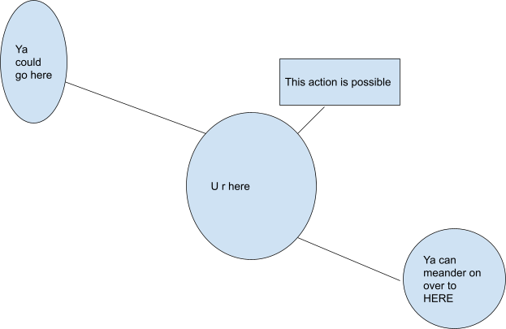

# Toad Bot Code Plan
_and other sketchings-out of the project_

-----------------

(in case this isn't displaying right: [Toad Bot Code Plan](Toad%20Bot%20Code%20Plan.pdf))

json stuff: tracking player position, map info (is any of this procedurally generated? or will it all be fixed?), any other player data

Objects:

What is the scale of this…

hmm

i’ve had a couple ideas for what direction this should go in that i’ve been putting in why.md on the why branch imma stick them in here

Cool, are you able to VC for a bit to talk about them?

maybe not right now, it’s pretty late and people are going to bed & so forth

Understandable, I will be able to talk to you about it tmrw and text works too :thumbs\_up:

alrighty, apologi

A GUI for the map could be cool. It might be difficult to render a complete map, but it might be possible to have a small bubble group thing like

yeah, like of where all the players are you mean?

ooh also have you looked at Kaes’ toadRL?

I have seen it on his computer

I know of a few bots that respond to commands with just an image, I bet there are python libraries to pretty easily generate these images.

eehhehe heck yeah that would be very fun.

it could also be fun to see what we can do in ascii, and just output a little code block to the discord server of the map or something, but you’d have way way less detail then. it would work for something roguelike-like, but maybe not for a different style. But also if it’s more story-ish like the google classroom bits were, you could just have it be a way for players to see who’s where, like the zoomed out overview of everyone’s paths or something

Ok.

I think a good next question is how much choice is given for how the user interacts? I was thinking having them have 2 commands, one to generate a new option and one to move to an already generated location. I was also considering a third command ot allow them an action in a location, but I donno how much complexity that would add to the system.

oooh i really like that idea

ok

so

yes…

wait hold on ok is this all going to be handledo no wait ok so if this is still like there’s a gm of some sort, where players can go to areas and interact but also make stuff up, i… yeah like is one of us still coming up with what OOh oh wait no ok sorry hold on

so when players generate new spaces to go to, are they literally the ones writing the landscape? so like is each person… hold on my brain needs to translate this to words gimme a second

so there’s kind of a set map for the game, and that can be held in a database. If it’s stored in a way that’s basically plaintext, that doesn’t mean anything to the system, it’s just meant to be read by players, then it could actually be pretty easy probably to write something that can process this (sorry i’m kind of saying this backwards) so a player can write ~landscape add (just amking stuff up here) room (type) or wait wait

~story add \[architecture/event/type of thing\] \[plaintext of what they want\] and then when other players … that could literally be plaintext stored in a json table under a key of what ok ok ok this is very fun

`{“kitchen”:”it’s like 6feet and there’s a kettle over there and etc. etc. doors here and here.”}`

Yeah^^^^ exactly

So what I imagined was that someone would traverse through room, for example go from the kitchen to the hall, and then they have the option to go to the doorway, or they have the option to make a new option that is goto the cellar. And then they define the cellar. And then the name of the room is the key, and it points to an object that is a whole bunch of strings with the readout for going to the place, and what other options are available from there

ok yes i love it

so the script is literally not parsing any variables about the space. it can be factually incorrect. but the players can agree upon it, and see what other people have added, etc. ok this sounds very good...

Yeah, it would just be defining text that is written when an action is taken

WONDERFUL ok so heeehoo how do we doo…

we need something that basically just tracks position, and what keys (locations) are available from that position, and maybe also what entities (players? are there any npcs?) are visible from there as well. we don’t need to track what the player could do so much, since they can add …. hmm wait

It might be possible to not have to add those systems like nps and whatnot if we just add a general “action” option. So in addition to having the option to goto a new room, they have the option to take an action in a current room. That action could be inspectings things or talking to bppeople

They could be added by the players just like new rooms

(this is all what my original vision is, but other options are definitely viable)

ok

so are those actions pre-determined? or are those also sort of customizable? ok got it… so are there a few that we’re going to set ahead of time? or are they all going to be player-generated? like should we prompt … is it just sort of like a general “what do you do now” for each… ooh wait also is it turn-based? because if a player inspects an object in a room they made up, who determines what they find out about the object?

I was thinking that the “action” command would just be another text readout, but we totally have the option for an inv system where items can be obtained and used, but I’m not sure how much more difficult that would be  

right… i bet you could do it by having the items also be sort of plaintext, like maybe part of defining a room is the player defines what’s IN the room…. OH WAIT NO idea:

there could be some element of procedurally generating contents, like a region can have a biome or just certain traits, and if a player creates a room in that biome, it will fill it with appropriate stuff, (note that at this point i’m talking about code i have no clue how to write), and that way players aren’t just sort of playing with themselves, making up what they find when they explore a new space that they made up. (this is all sort of a way to get around there having to be a game master who handles the stuff people add)

The player making up the whole story for themselves makes sense as a thing to avoid...

yeah

but then also it’s fun when they’re leaving behind stuff that becomes fixed, that other people can interact with, so it’s tricky

Totally

So in terms of minimal viable product, I think a good place to start is to just get traversal from room to room and the ability to build out a web

yeah that’s a very good idea

Object:

*   Room
	*   Description
		*   paintext
		*   Is the text that plays when players enter the room
	*   Possible moves
		*   List of keys to room objects
		*   Force the user to add a way back to the room that links to this one
*   Player
	*   Position
		*   Key to room object
		*   Stores what room they are in
	*   Contributions
		*   Int
		*   Just a fun stat to have
	*   Inv
		*   Later feature dont worrt about for now

Commnads:

-   where am i?
	-   (no arguments)
	-   what can you see, what’s your position (key/name of location), who’s there
	-   could also list available actions here
	-   automatically prints when you move to a new location
-   Act
	-   (option, either in text key, or number)
	-   one of the pre-set ones
	-   generate new
		-   ???
*   Go
	*   (option, either in text key or number)
	*   one of the available locations
		*   make sure we’re not letting people teleport to other pre-defined places
	*   make a new place (will there be times when you can’t? like there’s no door frame there, you can’t make up a room behind it?)
		*   also make sure to catch overlapping names, we don’t want to overwrite the stuff & i don’t know how to write that atm
		*   two ways we could do this: one command, so `~go new room-key then lots of words in the same line describing the place that gets stored as a string`, or `~go new` and then somehow it prompts you for keyname and description info & stuff
	*   Totally, probably prompts would be less confusing
		*   agreed. is there a way to do that in discord though? because it would have to be listening outside of the whole ctx command list, and you could certainly open up a loop once the code hears the \`~go new\` command, but then how do you get input? (we can figure this out later too)
		*   It is possible, one sec, I have some code that does this  ooooohohoo ok

Look in discord

